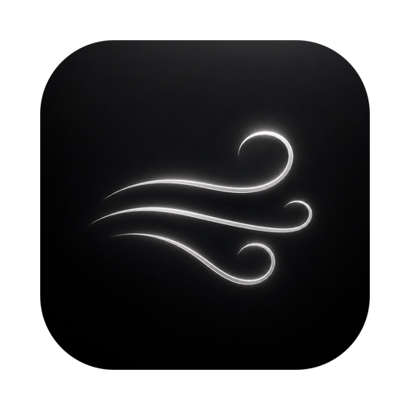

<p align="center">
  
</p>

<h1 align="center">Aeolus</h1>

<p align="center"><b>The MacBook notch, doing two things perfectly.</b></p>

<p align="center">
  <a href="https://github.com/moverq1337/Aeolus/actions/workflows/ci.yml"></a>
  <a href="https://github.com/moverq1337/Aeolus/releases/latest"></a>
  
  
  <a href="LICENSE"></a>
</p>

---

Aeolus turns the notch into a Dynamic Island for macOS — media playback
and battery, nothing else. Named after the keeper of the winds who lived
on the floating island of Aeolia.

- **Now Playing, universally.** Any audio source — Music, Spotify, browsers.
  Hover or click the notch: album art, title, scrubbing, transport controls,
  and system volume behind an output-device button that shows what you're
  actually listening on — AirPods Pro look like AirPods Pro.
- **Battery moments.** Plug in, unplug, low battery — a quiet flash around
  the notch, then silence.
- **Nothing else.** No file shelves, no widgets, no calendars. Minimalism
  is the feature.

## Feel

- **Event-driven to the bone.** Nothing runs unless something changes: no
  timers, no polling, no background loops. Media, battery, volume, focus,
  lock state — all observed, never asked. When nothing happens, Aeolus
  does nothing, and Activity Monitor proves it.
- 120 Hz ProMotion springs, tuned to match the iPhone Dynamic Island.
- **0.0% measured CPU** — even while music plays, the equalizer breathes
  inside the render server, not the app. Zero timers, zero polling;
  everything is event-driven. When nothing happens, Aeolus does nothing.
- Pure black, native SF typography. Indistinguishable from the system.
- Stays put across three-finger Space swipes and full-screen apps.

## Requirements

- MacBook with a notch (MacBook Pro 2021+, MacBook Air 2022+)
- macOS 15 Sequoia or later, Apple Silicon

## Install

### Homebrew

```sh
brew install --cask moverq1337/aeolus/aeolus
```

### Manual

Download the zip from [Releases](https://github.com/moverq1337/Aeolus/releases),
move Aeolus.app to /Applications.

Aeolus is not notarized (no Apple Developer subscription — this is a free
project). On first launch macOS will refuse to open it:
System Settings → Privacy & Security → **Open Anyway**. Once. Updates
delivered through the built-in updater need no repeat of this dance.

### Build from source

```sh
brew install xcodegen
git clone https://github.com/moverq1337/Aeolus.git && cd Aeolus
xcodegen generate
xcodebuild -project Aeolus.xcodeproj -scheme Aeolus -configuration Release build
```

## How Now Playing works

Apple locked the private MediaRemote framework away from third-party apps
in macOS 15.4. Aeolus uses [mediaremote-adapter](https://github.com/ungive/mediaremote-adapter)
(BSD-3): a helper loaded through an Apple-signed platform binary streams
Now Playing data. If a future macOS closes this path, Aeolus degrades
gracefully — the island keeps working for battery.

## License

MIT © [moverq1337](https://github.com/moverq1337).
See [THIRD-PARTY.md](THIRD-PARTY.md) for bundled components.
